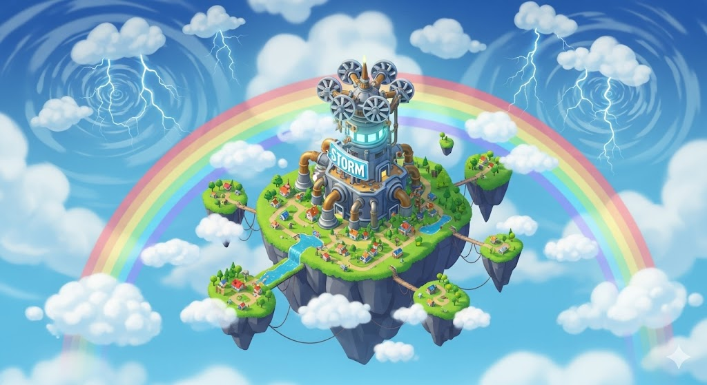

# ☁️🌈 Cloud Kingdom Tycoon – Game Design Overview 🌩️⛈️

---

## 🌥️ Game Overview
**Title:** Cloud Kingdom Tycoon  
**Genre:** Tycoon / Idle / Simulator  
**Platform:** Roblox (PC, Mobile, Console)  

**Core Loop:**  
☁️ Collect clouds → 🌦️ Generate weather → 💰 Sell for SkyCoins → ⛅ Upgrade islands, weather, and automation  

**Premise:**  
Start as a humble cloud gatherer and become a master of the skies. Unlock everything from gentle drizzle to devastating hurricanes while expanding your Cloud Kingdom across breathtaking islands.  

**Audience:** Ages 8–18 and casual simulator fans  

---

## 🌦️ Weather Progression (By Severity)

| 🌡️ Tier | 🌤️ Weather Type | ✨ Description | 🎯 Rarity | 💰 Sell Value |
|----------|----------------|----------------|-----------|---------------|
| 1 | Drizzle ☔ | Gentle rain, beginner-friendly | Common | 10 |
| 2 | Fog 🌫️ | Misty, low-visibility weather | Common | 25 |
| 3 | Rain 🌧️ | Steady showers, richer clouds | Uncommon | 60 |
| 4 | Snow ❄️ | Soft snowflakes, cool atmosphere | Uncommon | 150 |
| 5 | Rainbow 🌈 | Colorful arcs after rain | Epic | 500 |
| 6 | Thunderstorm ⚡ | Lightning strikes, booming thunder | Rare | 1,200 |
| 7 | Hailstorm ❄️💎 | Fast-falling icy pellets | Rare+ | 5,000 |
| 8 | Aurora 🌌 | Magical light waves in night sky | Mythic | 8,000 |
| 9 | Blizzard 🌬️❄️ | Extreme snowstorm with roaring winds | Mythic | 12,000 |
| 10 | Tornado 🌪️ | Fierce rotating wind column | Legendary | 25,000 |
| 11 | Monsoon 🌊 | Torrential tropical rains | Legendary | 60,000 |
| 12 | Hurricane 🌪️🌊 | Ultimate destructive force of nature | Ascended | 150,000 |

**Progression Principle:**  
- Early tiers = quick, satisfying loops  
- Mid tiers = visually dramatic, rewarding upgrades  
- Late tiers = status symbols and endgame mastery  

---

## 🗺️ Player Progression Roadmap

| 🏝️ Stage | 🔓 Milestone | 🌪️ Weather Tier | 💎 Player Reward | 🎨 Visual / Emotional Impact |
|-----------|--------------|----------------|----------------|------------------------------|
| Cloud Gatherer | Starting Island | Drizzle ☔ | Basic SkyCoins | Gentle raindrops, soft clouds |
| Misty Explorer | Misty Meadow | Fog 🌫️ | Slightly faster collection | Mysterious misty skies |
| Rain Collector | Rainy Basin | Rain 🌧️ | Rain multiplier | Steady showers, satisfying FX |
| Snow Adventurer | Snowcap Peak | Snow ❄️ | Snow upgrades | Snowy landscapes, fluffy visuals |
| Rainbow Creator | Rainbow Gardens | Rainbow 🌈 | Rare SkyCoins | Bright colorful rainbows |
| Storm Master | Storm Plains | Thunderstorm ⚡ | Thunderstorm upgrades | Lightning strikes, booming thunder |
| Ice Tamer | Icy Crags | Hailstorm ❄️💎 | Fastest weather generation | Dramatic hail and cloud FX |
| Aurora Keeper | Northern Lights Valley | Aurora 🌌 | Unique visual aura | Glowing ethereal skies |
| Blizzard Conqueror | Frozen Wastelands | Blizzard 🌬️❄️ | Prestige prep & efficiency | Extreme snowstorm visuals |
| Twister Lord | Twister Flats | Tornado 🌪️ | Tornado upgrades | Rotating winds, intense particles |
| Monsoon Overlord | Tropical Storm Isles | Monsoon 🌊 | Seasonal events & cosmetics | Torrential rain, dynamic water |
| Hurricane God | Eye of the Storm | Hurricane 🌪️🌊 | Prestige unlocked, ultimate SkyCoins | Massive destructive spectacle |

---

## ☁️ Tycoon Systems

- 🌩️ **Cloud Collection:** Tap or hold clouds; upgrade for speed & capacity  
- 🌦️ **Weather Generation:** Convert clouds into weather; rare weather = bigger payout  
- 💰 **Selling / Economy:** Sell weather at stations for SkyCoins  
- ⚡ **Upgrades:** Speed, capacity, weather multiplier, unlock new islands  
- 🤖 **Automation:** Pets, auto-collectors, efficiency boosters  

---

## 💰 Currencies

| 💎 Currency | 🛠️ Purpose | 🔑 Acquisition |
|-------------|------------|----------------|
| SkyCoins | Main currency for upgrades & islands | Selling weather |
| SkyGems | Premium currency for boosts & cosmetics | Purchase or events |
| Weather Crystals | Craft rare upgrades or hybrid weather | High-tier weather or events |

---

## ✨ Prestige Flow

- Unlock after Hurricane Tier  
- Reset progression but gain **permanent bonuses**:  
  - ⚡ Faster collection  
  - 🤖 Auto collector upgrades  
  - 💰 Extra SkyCoins per weather  
- Encourages **long-term replayability**  

---

## 🤖 Automation & Efficiency

- 🐦 Pets / Companions: Auto-gather clouds  
- ⚙️ Auto Generators: Automated weather production  
- ⏱️ Efficiency Boosts: Speed multipliers, cooldown reduction, sales multipliers  

---

## 🌍 Multiplayer Integration

- 👥 **Shared Skies:** Visit friends’ islands  
- 🏆 **Leaderboards:** Track top tycoons  
- 🌪️ **Co-op Weather Events:** Combine clouds to generate rare weather (Mega Storms)  

---

## 🎨 Visual Style & Feedback

- ☁️ Soft, dreamy clouds + exaggerated weather effects  
- 🌈 Particle FX, dynamic lighting, audio cues per weather type  
- 💥 Reward feedback: visual pop-ups, particle explosions, satisfying animations  

---

# 🐦 Pets & 🤖 Auto-Collectors – Cloud Kingdom Tycoon

---

## 🐦 Pets (Cloud Companions)

| 🏷️ Tier | 🐾 Pet Name | ✨ Effect / Bonus | 🎨 Visual / Personality |
|---------|------------|-----------------|------------------------|
| Early / Common | Fluffy the Cloud Cat | Auto-collects small clouds (+5% SkyCoins) | Fluffy, white cat floating on tiny clouds |
| Early / Common | Drizzle Duckling | Leaves tiny rain trails that slightly boost Drizzle generation | Yellow duckling with tiny umbrella |
| Early / Common | Nimbus Bunny | Hops on clouds; occasional low-tier cloud multiplier | White bunny with cloud-shaped ears |
| Mid / Uncommon | Storm Squirrel | Spins mini tornadoes; +10% weather generation speed for 10s | Energetic grey squirrel with lightning sparks |
| Mid / Uncommon | Frost Fox | Adds snowflake multipliers; boosts Snow generation | Light blue fox with frosty tail |
| Mid / Uncommon | Rainbow Parrot | Collects rainbow fragments; chance to double Rainbow payout | Colorful parrot with glittering wings |
| Late / Rare | Thunder Eagle | Creates mini lightning strikes; auto-generates Thunderstorm weather | Large eagle with electric feathers |
| Late / Rare | Aurora Owl | Glows in Northern Lights; passive SkyCoins multiplier | Elegant owl with glowing aurora wings |
| Late / Legendary | Puff the magic Dragon | Auto-collects all clouds; boosts rare weather by 50% | Massive dragon with stormy cloud wings |

---

## 🤖 Auto-Collectors

| 🏷️ Tier | ⚙️ Collector Name | ✨ Effect / Bonus | 🎨 Visual / Personality |
|---------|-----------------|-----------------|------------------------|
| Early / Common | Mini Cloud Harvester | Auto-collects common clouds | Small machine with rotating scoop arms |
| Early / Common | Rain Bucket | Converts clouds into Rain weather automatically | Wooden bucket with spout and raindrops |
| Early / Common | Fog Fan | Pulls in low-tier clouds to increase Fog generation | Fan with swirling mist around it |
| Mid / Uncommon | Storm Tower | Periodically generates Thunderstorm clouds | Tall tower with small lightning rods |
| Mid / Uncommon | Snow Cannon | Produces Snow weather clouds automatically | Cannon that shoots out soft snowflakes |
| Mid / Uncommon | Rainbow Prism | Converts small weather types into rainbow fragments | Crystal prism reflecting colorful light |
| Late / Rare | Hail Launcher | Launches Hailstorm clouds to storage; high yield | Metallic launcher with icy spikes |
| Late / Rare | Aurora Beacon | Generates Aurora weather fragments; boosts nearby collectors | Tower emitting glowing aurora light |
| Late / Legendary | Hurricane Engine | Pulls clouds from all islands; auto-generates Hurricane weather | Massive mechanical engine surrounded by swirling clouds |

---

### 💡 Notes / Synergy Ideas
- Pets can **enhance specific collectors**, e.g., Frost Fox boosts Snow Cannon efficiency.  
- **Event-only pets or collectors** can be added for seasonal rewards (Snowman Pet, Halloween Fog Machine).  
- **Hybrid collectors**: Combine multiple low-tier collectors to produce a higher-tier weather type.  

## 🔮 Optional Endgame Features

- ⚡ **Weather Fusion:** Combine 2 weather types for hybrid effects  
- 🎉 **Seasonal Weather Events:** Limited-time rare rewards  
- 🤝 **Sky Guilds / Alliances:** Cooperative or competitive goals  
- 🏆 **Prestige Leaderboards:** Global ranking of Weather Gods  
- 🏝️ **Special Islands:** Hidden islands with extreme challenges  
